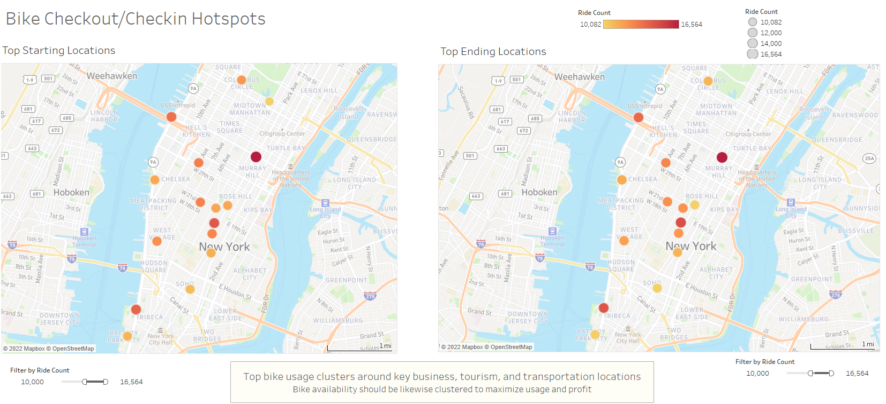
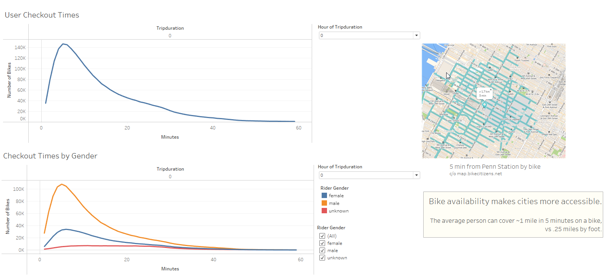
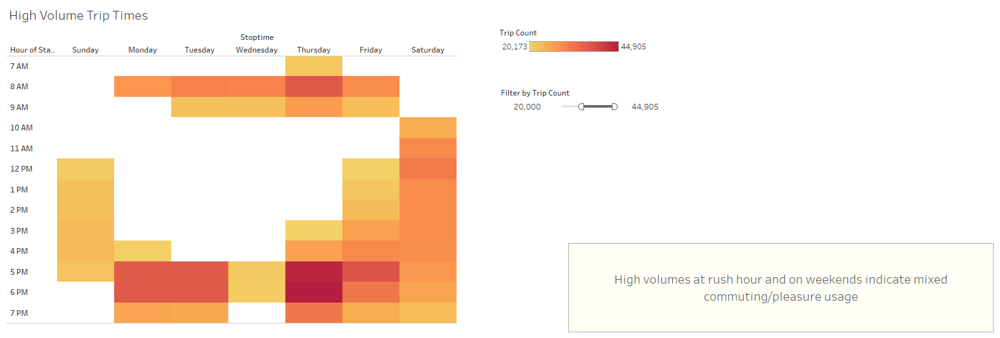
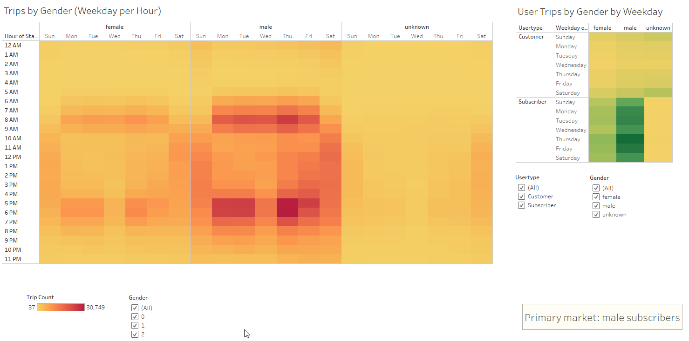

# bikesharing

## Overview

This analysis explores New York Citi Bike data to determine the viability of a similar bikesharing enterprise elsewhere. Exploration and presentation of findings are done using Tableau worksheets, dashboards, and stories. 

[The Tableau story is available here](https://public.tableau.com/app/profile/katelin.burke/viz/BikeshareBusinessValue/BikeshareBusinessValue?publish=yes); further analysis is provided below.

## Results

### Hotspots

Side-by-side comparison of the bike stations where at least 10,000 rides started or ended indicates that bikeshare usage is strongly clustered around key points in the city. Bikeshare companies in other cities would benefit from identifying what such key points in their own cities might be, as well as what brings potential customers there--be that tourist destinations, businesses commuted to by cyclists, or intersections with other forms of transit.

### Trip Duration

Trip duration peaks strongly at around 5 minutes, then declines to near-statistical insignificance by 60 minutes. While the overwhelming majority of Citi Bike's customers are male, usage times by female customers share a similar peak.

A couple of likely conclusions can be drawn from the fact that bikeshare bikes are overwhelmingly used for short trips:
1. To encourage use, bikeshare stations should be available at least every mile or so, since that roughly corresponds to the distance traveled in the most common trip length
2. Potential customers are less likely to use a bikeshare to move between locations that are multiple miles apart. 
    * In cities where potential destinations are densely located, bikeshare availability could increase the number of visitors by increasing their ability to move easily between them. 
    * However, in more far-flung, less-dense cities, investors might want to carefully consider the likelihood that bikes would be used, or place bike stations only in areas with sufficient density of destinations

### High Volume Trip Times

Filtering to the most common trip times indicates some clear patterns. In New York, bikeshare usage peaks at rush hour and on weekends, with the most popular times being weekday evenings. This indicates that bikeshares are likely used for a mixture of commuting and pleasure. When cross-referenced with the average trip duration, the high prevalence of evening weekday use means that the most common use of bikeshare is likely to get from work to nearby post-work destinations, like bars or restaurants.

In a public-transit oriented city like New York, this pattern makes sense; however, more car-oriented cities will want to be careful about assuming that the same usage patterns would hold true. Commuters traveling longer distances are less likely to do so by bike, and those who drove to work are more likely to drive to subsequent destinations than rent a bike.

### Demographic Distribution

Heatmapping the breakdown of trips by timing, gender, and usertype reveals a couple of things:
1. While the majority bikeshare users are male, male and female users have similar timing patterns.
2. The gender of one-time customers is more likely to be unknown than it is for subscribers
3. One time-customers, especially those of unknown gender, are more likely to use bikeshares on weekends than weekdays. 

Regardless of gender, subscribers appear more likely to use bikeshares on weekdays, whereas one-time customer usage peaks on weekends.

## Summary

This analysis draws many conclusions about bikeshare usage in New York City that will likely be applicable to other high-density, public transit-oriented cities. However, implementation and usage in lower-density, driving-oriented cities will likely look very different. Analysis of trip duration and peak usage from such a city would be a useful counterpoint in predicting how and to what extent a bikeshare program would be used.

That information is not available within the Citi Bike data, of course, but a couple of additional visualizations from Citi Bike datasets might provide important decision support for potential investors:

* Checkout time by subscriber type: Comparing these two variables would provide insight into the trip lengths, and therefore the ideal bike station, of two different customer markets. This would be important information for a city where weekend tourist usage might be more common than weekday commuter/after-work usage.
* Seasonal variance: The visualizations here do not account for seasonal variation, which will be important in any city with significant seasonal weather differences. Showing the difference in usage between summer and winter would help potential investors determine whether summer peaks are sufficient to ride out wintertime lows.